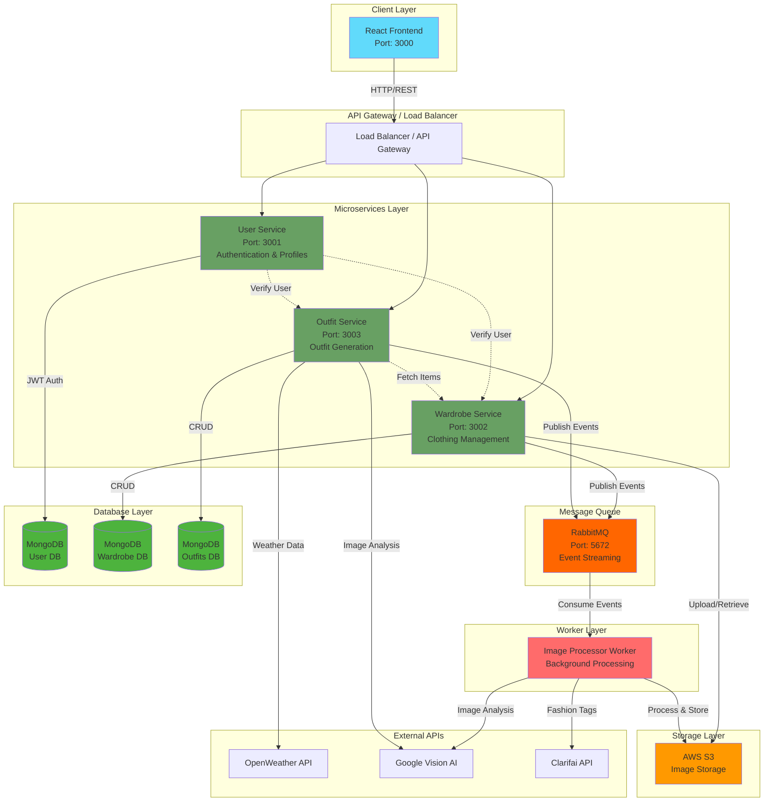

# 👗 Closet-X - Your Digital Closet Assistant

> AI-powered wardrobe management web application that helps you organize your closet, get outfit suggestions, and make smarter fashion decisions based on weather and usage patterns.

## 🌟 Overview

Closet-X is a digital closet web application that revolutionizes how you manage your wardrobe. Upload photos of your clothing items and let AI handle the rest! Get personalized outfit suggestions, track your most-worn items, receive weather-based recommendations, and even get suggestions on items you might want to sell.

## ✨ Key Features

- 📸 **Photo Upload** - Easily upload photos of your clothing items
- 🤖 **AI-Powered Outfit Suggestions** - Get fashion-forward outfit combinations based on your wardrobe
- 🌤️ **Weather Integration** - Receive outfit recommendations tailored to current weather conditions
- 📊 **Usage Tracking** - See which items you wear most and least frequently
- 💰 **Smart Sell Suggestions** - Get notified about items you rarely wear that could be sold
- 🎨 **Fashion Trend Analysis** - AI integrates with fashion datasets for trendy suggestions
- 🔐 **Secure Authentication** - JWT-based authentication with OAuth support

## 🏗️ System Architecture



### Architecture Overview

**Closet-X** follows a **microservices architecture** with the following components:

#### Frontend Layer
- **React Web Application**: Single-page application providing the user interface
- Communicates with backend services via REST APIs
- State management with React Context/Redux

#### Microservices
1. **User Service** (Port 3001)
   - User authentication and authorization (JWT)
   - User profile management
   - OAuth integration (Google/Facebook)

2. **Wardrobe Service** (Port 3002)
   - Clothing item CRUD operations
   - Image upload handling
   - Wardrobe organization and filtering
   - Publishes events to RabbitMQ for async processing

3. **Outfit Service** (Port 3003)
   - AI-powered outfit generation
   - Weather-based recommendations
   - Usage tracking and analytics
   - Fashion trend integration

#### Worker Layer
- **Image Processor Worker**: Background job processor
  - Consumes events from RabbitMQ
  - Performs AI image analysis (Google Vision, Clarifai)
  - Generates clothing metadata and tags
  - Optimizes and stores images in S3

#### Infrastructure
- **MongoDB**: Separate databases for each service (users, wardrobe, outfits)
- **RabbitMQ**: Message queue for asynchronous event processing
- **AWS S3**: Scalable image storage
- **Docker**: Containerization for all services
- **Kubernetes**: Orchestration (production deployment)

#### External Integrations
- **OpenWeather API**: Real-time weather data
- **Google Vision AI**: Advanced image recognition
- **Clarifai API**: Fashion-specific image tagging

### Data Flow Example: Uploading a Clothing Item

1. User uploads image via **React Frontend**
2. Request routed to **Wardrobe Service**
3. Wardrobe Service stores image temporarily and publishes event to **RabbitMQ**
4. **Image Processor Worker** consumes event
5. Worker processes image with **Google Vision/Clarifai**
6. Worker uploads optimized image to **S3**
7. Worker updates **MongoDB** with metadata
8. Frontend receives confirmation and displays item

## 🛠️ Tech Stack

### Frontend
- **Framework**: React.js
- **Styling**: Material-UI / Tailwind CSS
- **State Management**: React Context / Redux
- **HTTP Client**: Axios

### Backend Microservices
- **Runtime**: Node.js
- **Framework**: Express.js
- **Authentication**: JWT, OAuth (Google/Facebook)
- **Image Processing**: Multer, Sharp
- **API Documentation**: Swagger/OpenAPI

### Database & Storage
- **Database**: MongoDB (NoSQL) - Separate DBs per service
- **Image Storage**: AWS S3
- **Caching**: Redis (planned)

### Message Queue
- **Message Broker**: RabbitMQ
- **Protocol**: AMQP

### AI & External APIs
- **Image Recognition**: Google Vision AI, Clarifai
- **Weather Data**: OpenWeather API
- **Fashion Trends**: Custom ML models

### DevOps & Infrastructure
- **Containerization**: Docker
- **Orchestration**: Kubernetes
- **CI/CD**: GitHub Actions (planned)
- **Monitoring**: Prometheus + Grafana (planned)

### Testing
- **Frontend**: React Testing Library, Jest
- **Backend**: Jest, Mocha, Supertest
- **API Testing**: Postman

## 📋 Project Structure

```
Closet-X/
├── frontend/                 # React web application
│   ├── src/
│   ├── public/
│   └── package.json
├── services/
│   ├── user-service/        # User authentication & management
│   │   ├── src/
│   │   ├── Dockerfile
│   │   └── package.json
│   ├── wardrobe-service/    # Clothing item management
│   │   ├── src/
│   │   ├── uploads/
│   │   ├── Dockerfile
│   │   └── package.json
│   └── outfit-service/      # Outfit generation & recommendations
│       ├── src/
│       ├── cache/
│       ├── Dockerfile
│       └── package.json
├── workers/
│   └── image-processor/     # Background image processing
│       ├── src/
│       ├── Dockerfile
│       └── package.json
├── infrastructure/
│   └── scripts/             # Database initialization scripts
├── k8s/                     # Kubernetes deployment configs
├── shared/                  # Shared utilities and types
├── docs/                    # Additional documentation
├── docker-compose.yaml      # Local development setup
└── package.json             # Root package file
```

## 🚀 Getting Started

### Prerequisites
- **Node.js** (v18 or higher)
- **Docker** & **Docker Compose**
- **MongoDB** (or use Docker container)
- **npm** or **yarn**

### Environment Variables

Create a `.env` file in the root directory with the following variables:

```bash
# AWS S3
AWS_ACCESS_KEY_ID=your-aws-access-key
AWS_SECRET_ACCESS_KEY=your-aws-secret-key
S3_BUCKET=closet-x-dev
AWS_REGION=us-east-1

# External APIs
OPENWEATHER_API_KEY=your-openweather-api-key
GOOGLE_VISION_API_KEY=your-google-vision-api-key
CLARIFAI_API_KEY=your-clarifai-api-key
```

### Installation & Setup

#### Option 1: Using Docker (Recommended)

1. **Clone the repository**
```bash
git clone git@github.com:HannaSaffi/Closet-X.git
cd Closet-X
```

2. **Install all dependencies**
```bash
npm run install-all
```

3. **Start all services with Docker Compose**
```bash
npm run start-dev
```

This will start:
- MongoDB (Port 27017)
- RabbitMQ (Port 5672, Management UI: 15672)
- User Service (Port 3001)
- Wardrobe Service (Port 3002)
- Outfit Service (Port 3003)
- Image Processor Worker

4. **Access the services**
- Frontend: http://localhost:3000
- User Service API: http://localhost:3001
- Wardrobe Service API: http://localhost:3002
- Outfit Service API: http://localhost:3003
- RabbitMQ Management: http://localhost:15672 (user: closetx, pass: closetx123)

#### Option 2: Manual Setup

1. **Clone the repository**
```bash
git clone git@github.com:HannaSaffi/Closet-X.git
cd Closet-X
```

2. **Install dependencies for each service**
```bash
# Install all services
npm run install-services

# Install workers
npm run install-workers

# Install frontend
cd frontend && npm install && cd ..
```

3. **Start MongoDB**
```bash
mongod
```

4. **Start RabbitMQ**
```bash
# Using Docker
docker run -d --name rabbitmq -p 5672:5672 -p 15672:15672 rabbitmq:3.12-management-alpine
```

5. **Run services individually**
```bash
# Terminal 1 - User Service
cd services/user-service
npm run dev

# Terminal 2 - Wardrobe Service
cd services/wardrobe-service
npm run dev

# Terminal 3 - Outfit Service
cd services/outfit-service
npm run dev

# Terminal 4 - Image Processor
cd workers/image-processor
npm start

# Terminal 5 - Frontend
cd frontend
npm start
```

### Database Initialization

Initialize the MongoDB databases with default schemas:

```bash
npm run init-db
```

Seed the database with sample data (optional):

```bash
npm run seed
```

## 🎯 API Endpoints

### User Service (Port 3001)
- `POST /api/auth/register` - Register new user
- `POST /api/auth/login` - User login
- `GET /api/users/profile` - Get user profile
- `PUT /api/users/profile` - Update user profile

### Wardrobe Service (Port 3002)
- `POST /api/wardrobe/items` - Upload clothing item
- `GET /api/wardrobe/items` - Get all clothing items
- `GET /api/wardrobe/items/:id` - Get specific item
- `PUT /api/wardrobe/items/:id` - Update clothing item
- `DELETE /api/wardrobe/items/:id` - Delete clothing item
- `GET /api/wardrobe/stats` - Get wardrobe statistics

### Outfit Service (Port 3003)
- `POST /api/outfits/generate` - Generate outfit suggestions
- `GET /api/outfits` - Get saved outfits
- `POST /api/outfits/weather` - Get weather-based recommendations
- `GET /api/outfits/trending` - Get trending outfit ideas
- `GET /api/outfits/analytics` - Get usage analytics

## 📱 Features in Detail

### 🖥️ Frontend (React Web App)

#### Core Components
- **Authentication Pages**: Login, Register, Password Reset
- **Dashboard**: Overview of wardrobe and recent outfits
- **Clothing Upload**: Drag-and-drop interface with image preview
- **Closet View**: Grid/list view with advanced filtering (type, color, season, fabric)
- **Outfit Generator**: AI-powered outfit suggestions with visual previews
- **Analytics Dashboard**: Visual charts showing wear patterns and trends
- **Settings**: User preferences and account management

### 🔧 Backend Services

#### User Service
- JWT-based authentication
- OAuth integration (Google, Facebook)
- User profile management
- Password reset functionality
- Role-based access control (future)

#### Wardrobe Service
- Image upload and storage
- CRUD operations for clothing items
- Advanced search and filtering
- Category and tag management
- Integration with S3 for scalable storage

#### Outfit Service
- AI-powered outfit generation algorithms
- Weather API integration for context-aware suggestions
- Usage tracking (most/least worn items)
- Sell suggestions based on wear patterns
- Fashion trend analysis

#### Image Processor Worker
- Asynchronous image processing
- AI-powered image categorization
- Automatic tagging (color, fabric, style)
- Image optimization and compression
- Thumbnail generation

### 🗄️ Database Schema Examples

#### Users Collection (User Service DB)
```javascript
{
  _id: ObjectId,
  email: String,
  password: String (hashed),
  name: String,
  preferences: {
    style: [String],
    favoriteColors: [String],
    location: String
  },
  createdAt: Date,
  updatedAt: Date
}
```

#### Clothing Collection (Wardrobe Service DB)
```javascript
{
  _id: ObjectId,
  userId: ObjectId,
  imageURL: String,
  thumbnailURL: String,
  category: String, // shirt, pants, jacket, shoes, etc.
  subcategory: String,
  color: [String],
  fabric: String,
  brand: String,
  season: [String], // spring, summer, fall, winter
  tags: [String],
  wearCount: Number,
  lastWorn: Date,
  dateUploaded: Date,
  aiMetadata: {
    confidence: Number,
    detectedObjects: [String]
  }
}
```

#### Outfits Collection (Outfit Service DB)
```javascript
{
  _id: ObjectId,
  userId: ObjectId,
  outfitName: String,
  clothingItems: [ObjectId],
  occasion: String,
  weather: {
    temperature: Number,
    condition: String,
    date: Date
  },
  fashionScore: Number,
  wornCount: Number,
  lastWorn: Date,
  generatedAt: Date
}
```

## 🎯 Roadmap

### Phase 1: Core Functionality (Current)
- [x] Project architecture setup
- [x] Docker containerization
- [x] MongoDB database design
- [x] User authentication service
- [ ] Frontend UI components
- [ ] Wardrobe management service
- [ ] Basic outfit generation

### Phase 2: AI Integration
- [ ] Image recognition integration
- [ ] AI outfit suggestion algorithm
- [ ] Weather-based recommendations
- [ ] Usage tracking system
- [ ] Sell suggestions feature

### Phase 3: Advanced Features
- [ ] Social features (outfit sharing)
- [ ] Calendar integration for outfit planning
- [ ] Shopping recommendations
- [ ] Wardrobe analytics dashboard
- [ ] Export/import functionality

### Phase 4: Optimization & Scaling
- [ ] Kubernetes deployment
- [ ] CI/CD pipeline
- [ ] Performance optimization
- [ ] Monitoring and logging
- [ ] Load testing
- [ ] Production deployment

## 🤝 Contributing

This is a team project with 3 developers. Please follow these guidelines:

### Branch Naming Convention
- `feature/` - New features
- `bugfix/` - Bug fixes
- `hotfix/` - Urgent fixes
- `refactor/` - Code refactoring

### Workflow

1. **Create a new branch**
```bash
git checkout -b feature/your-feature-name
```

2. **Make your changes and commit**
```bash
git add .
git commit -m "Add: description of your changes"
```

3. **Push your branch**
```bash
git push origin feature/your-feature-name
```

4. **Create a Pull Request** for review

### Commit Message Format
- `Add:` - New feature
- `Fix:` - Bug fix
- `Update:` - Update existing feature
- `Refactor:` - Code refactoring
- `Docs:` - Documentation changes
- `Style:` - Code style changes (formatting, etc.)
- `Test:` - Adding or updating tests

## 🧪 Testing

### Run all tests
```bash
npm test
```

### Run tests for specific service
```bash
cd services/user-service
npm test
```

### Run frontend tests
```bash
cd frontend
npm test
```

## 📊 Monitoring & Logs

Each service writes logs to its respective `logs/` directory:
- `services/user-service/logs/`
- `services/wardrobe-service/logs/`
- `services/outfit-service/logs/`

View live logs with Docker:
```bash
docker-compose logs -f [service-name]
```

## 🐛 Troubleshooting

### Services won't start
```bash
# Stop all containers
docker-compose down

# Remove volumes
docker-compose down -v

# Rebuild and restart
docker-compose up --build
```

### MongoDB connection issues
- Ensure MongoDB container is healthy: `docker ps`
- Check connection string in service environment variables
- Verify MongoDB is accepting connections: `docker logs closetx-mongodb`

### RabbitMQ connection issues
- Access RabbitMQ management UI: http://localhost:15672
- Check queue status and messages
- Verify credentials in docker-compose.yaml

## 👥 Team

- **Kuany Kuany** - Backend Developer
- **Hanna Saffi** - Frontend Developer
- **Aleksandra Postolov** - Database

## 📧 Contact

For questions or suggestions, please open an issue or contact the team.
