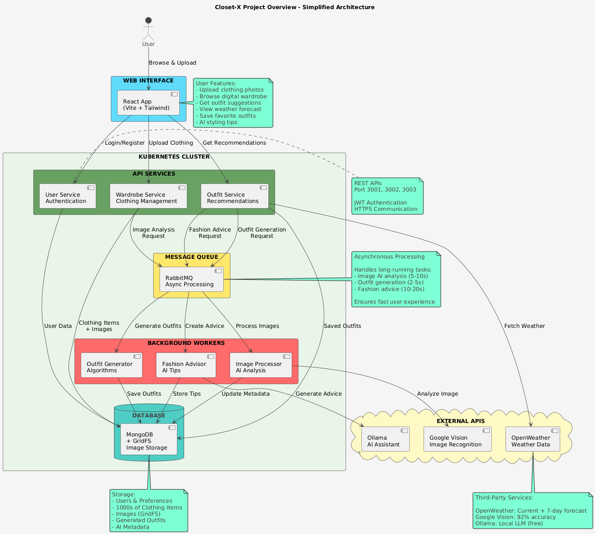

# Closet-X Architecture Documentation

---

## 📋 Table of Contents

1. [Architecture Diagrams](#-architecture-diagrams)
2. [System Overview](#system-overview)

---

## 📐 Architecture Diagrams

### System Architecture


*High-level overview showing all components: Frontend, Microservices, Message Queue, Workers, and Data Layer with external API integrations.*

---

### Deployment Architecture


*Kubernetes deployment showing pods, services, StatefulSets, ConfigMaps, and container orchestration.*

---

### Microservices Components


*Detailed component diagram showing internal service structure, controllers, models, and inter-service communication.*

---

### RabbitMQ Message Flow


*Asynchronous message processing workflow showing publish-route-consume-acknowledge cycle for image processing, outfit generation, and fashion advice.*

---

#### 📋 Three Main Asynchronous Workflows

**1. Image Processing Flow 🖼️**
```
User uploads photo → Wardrobe Service
                   ↓
              Publishes to RabbitMQ
              (routing key: "image.analyze")
                   ↓
           Image Processing Worker receives message
                   ↓
     Calls Google Vision AI to analyze clothing
     (identifies category, colors, style, fabric)
                   ↓
         Updates MongoDB with AI metadata
                   ↓
              Acknowledges message
```

**Why async?** AI image analysis takes 2-5 seconds. User gets immediate 201 Created response while processing happens in background. Without async, users would wait and experience poor UX.

---

**2. Outfit Generation Flow 👔**
```
User requests daily outfit → Outfit Service
                           ↓
              Publishes message to RabbitMQ
              (routing key: "outfit.generate")
                           ↓
              RabbitMQ queues the request
                           ↓
          Outfit Generator Worker consumes
                           ↓
    Runs complex algorithms:
    - Fetches user's wardrobe items
    - Applies color harmony rules (30% weight)
    - Calculates style compatibility (40% weight)  
    - Scores weather appropriateness (30% weight)
    - Generates combinations and ranks by score
                           ↓
           Saves top outfits to MongoDB
                           ↓
              Acknowledges message
```

**Why async?** Complex algorithm with multiple database queries and combinatorial calculations. Processing 50+ clothing items into outfit combinations can take 3-8 seconds. Async keeps API responsive.

---

**3. Fashion Advice Flow 💡**
```
User asks "What should I wear?" → AI Advice Service
                                 ↓
              Publishes to RabbitMQ
              (routing key: "fashion.advice")
                                 ↓
              RabbitMQ routes to queue
                                 ↓
            Fashion Advice Worker receives
                                 ↓
           Calls Ollama/Gemini LLM
           (generates personalized styling tips)
                                 ↓
              Stores advice in MongoDB
                                 ↓
              Acknowledges message
```

**Why async?** AI LLM calls can take 3-10 seconds depending on model and prompt complexity. User sees "AI is thinking..." spinner while response generates. Prevents API timeout and allows retry on failure.

---

**Key Benefits of Asynchronous Architecture:**
- ✅ **Fast user experience** - APIs return immediately (< 100ms)
- ✅ **Fault tolerance** - Messages persist if worker crashes
- ✅ **Scalability** - Add more workers to handle increased load
- ✅ **Decoupling** - Services don't wait for slow operations
- ✅ **Retry logic** - Failed messages can be requeued automatically

---

---

### Sequence Diagrams

#### Outfit Recommendation Flow


*User interaction flow for AI-powered outfit recommendations with weather integration.*

---

#### Image Upload & Processing Flow


*Complete workflow from clothing photo upload through AI analysis and metadata updates.*

---

### Database Schema


*Entity-relationship diagram showing MongoDB collections, relationships, and indexes.*

---

### Simplified Project Overview


*Easy-to-understand high-level view of the entire system: User → Frontend → Services → Queue → Workers → Database, with color-coded component layers.*

---

## System Overview

Closet-X is a cloud-native, microservices-based digital wardrobe management application deployed on Kubernetes. The system enables users to digitize their clothing collection, receive AI-powered outfit recommendations based on weather conditions, and manage their wardrobe efficiently.

### Key Architectural Characteristics

- **Architecture Style**: Microservices with Event-Driven Architecture (EDA)
- **Deployment Model**: Kubernetes (homelab cluster)
- **Communication**: REST APIs (synchronous) + RabbitMQ (asynchronous)
- **Data Store**: MongoDB with GridFS for images
- **Container Registry**: Harbor (private registry)
- **CI/CD**: GitHub Actions

### Core Components

- **3 RESTful Microservices**: User, Wardrobe, Outfit services
- **3 Background Workers**: Image Processor, Fashion Advice, Outfit Generator
- **1 Message Broker**: RabbitMQ for async communication
- **1 Database**: MongoDB (StatefulSet with persistence)
- **1 Frontend**: React SPA with Vite
