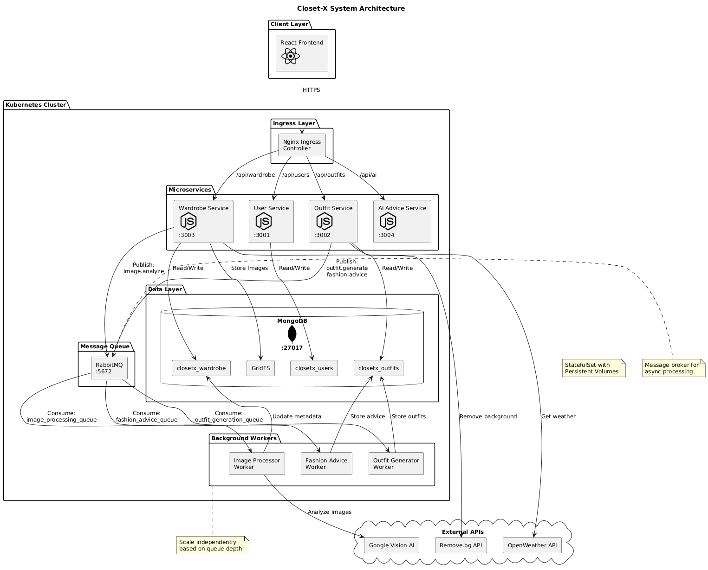
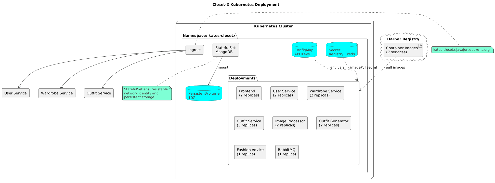
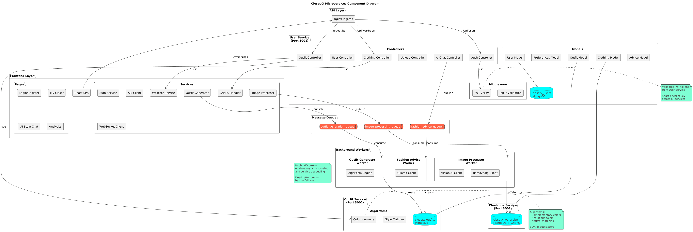
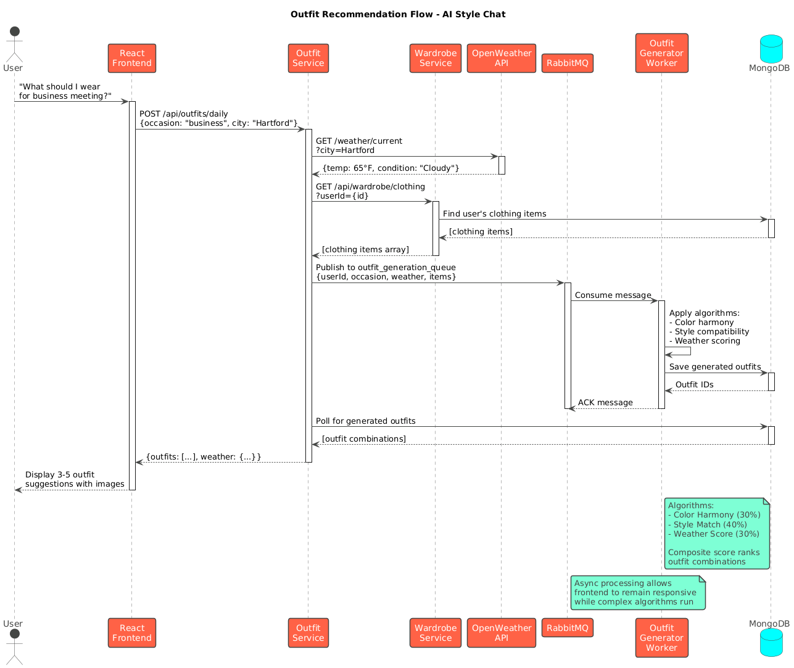
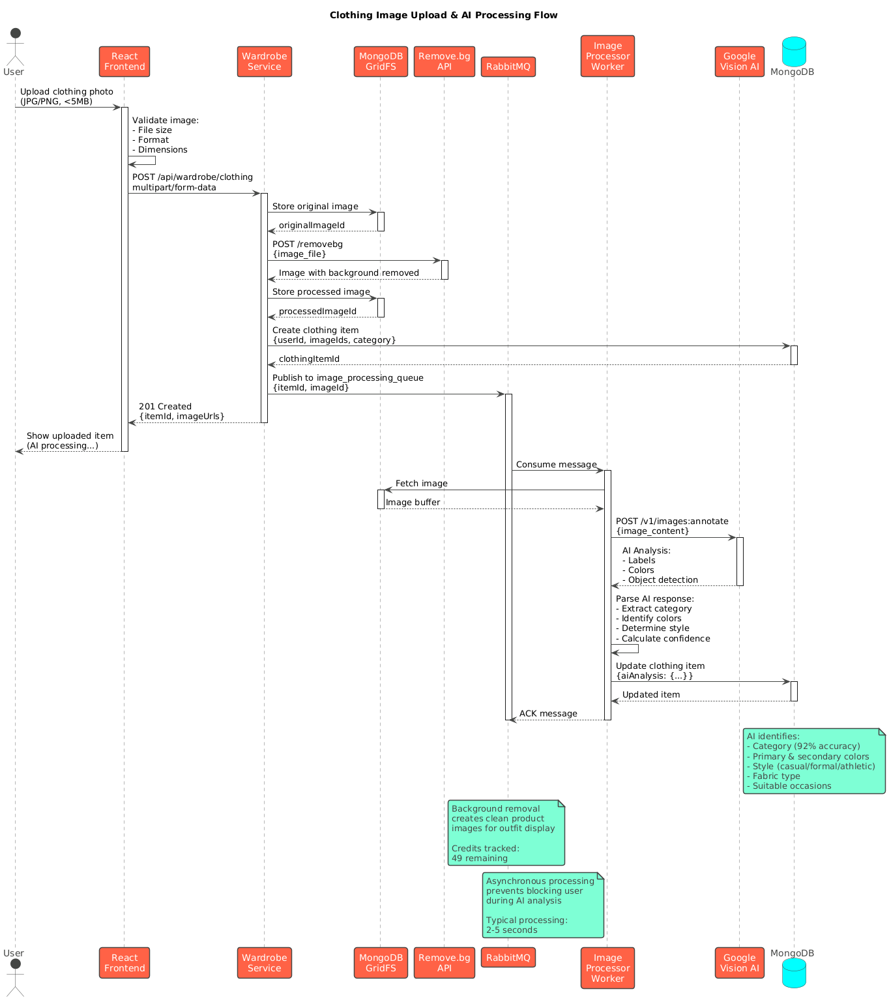
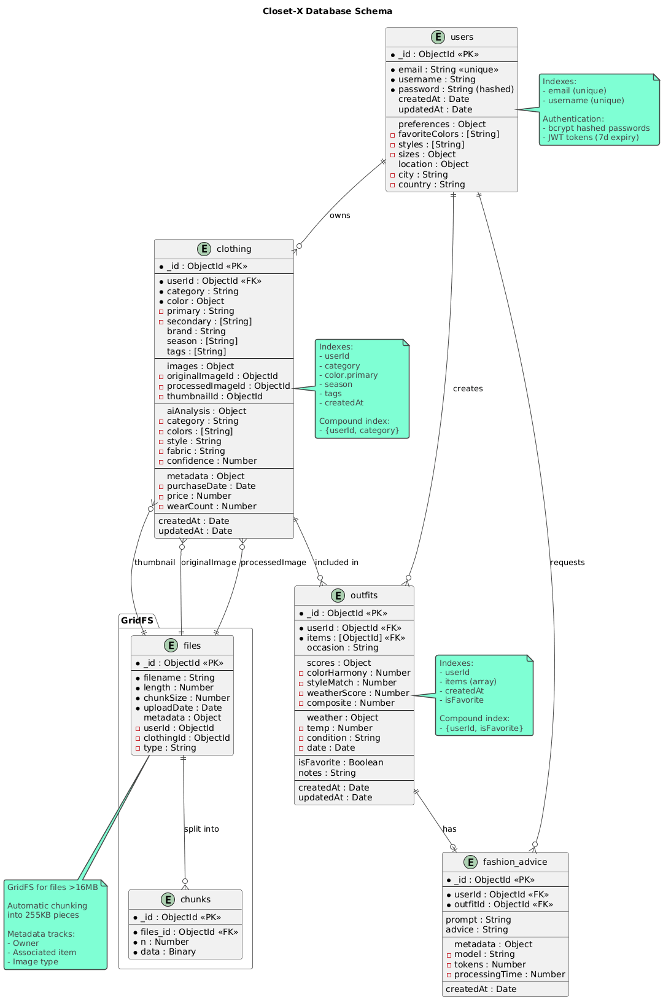

# Closet-X Architecture Documentation

**Version:** 1.0  
**Last Updated:** December 15, 2024  
**Team:** Team Kates (Kuany Kuany, Hanna Saffi, Ale Apostolo)

---

## 📐 Architecture Diagrams

### System Architecture

*High-level overview showing all components: Frontend, Microservices, Message Queue, Workers, and Data Layer with external API integrations.*

---

### Deployment Architecture

*Kubernetes deployment showing pods, services, StatefulSets, ConfigMaps, and container orchestration.*

---

### Microservices Components

*Detailed component diagram showing internal service structure, controllers, models, and inter-service communication.*

---

### Sequence Diagrams

#### Outfit Recommendation Flow

*User interaction flow for AI-powered outfit recommendations with weather integration.*

---

#### Image Upload & Processing Flow

*Complete workflow from clothing photo upload through AI analysis and metadata updates.*

---

### Database Schema

*Entity-relationship diagram showing MongoDB collections, relationships, and indexes.*

---

## Table of Contents

1. [System Overview](#system-overview)
2. [Architecture Principles](#architecture-principles)
3. [System Architecture](#system-architecture)
4. [Service Architecture](#service-architecture)
5. [Data Architecture](#data-architecture)
6. [Communication Patterns](#communication-patterns)
7. [Deployment Architecture](#deployment-architecture)
8. [Security Architecture](#security-architecture)
9. [Scalability & Performance](#scalability--performance)
10. [Design Decisions](#design-decisions)

---

## System Overview

Closet-X is a cloud-native, microservices-based digital wardrobe management application deployed on Kubernetes. The system enables users to digitize their clothing collection, receive AI-powered outfit recommendations based on weather conditions, and manage their wardrobe efficiently.

### **Key Architectural Characteristics**

- **Architecture Style**: Microservices with Event-Driven Architecture (EDA)
- **Deployment Model**: Kubernetes (homelab cluster)
- **Communication**: REST APIs (synchronous) + RabbitMQ (asynchronous)
- **Data Store**: MongoDB with GridFS for images
- **Container Registry**: Harbor (private registry)
- **CI/CD**: GitHub Actions

### **Core Components**

- **3 RESTful Microservices**: User, Wardrobe, Outfit services
- **3 Background Workers**: Image Processor, Fashion Advice, Outfit Generator
- **1 Message Broker**: RabbitMQ for async communication
- **1 Database**: MongoDB (StatefulSet with persistence)
- **1 Frontend**: React SPA with Vite

---

[Rest of the content remains the same...]
